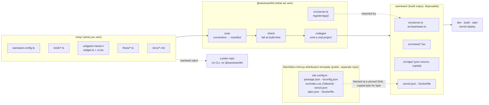
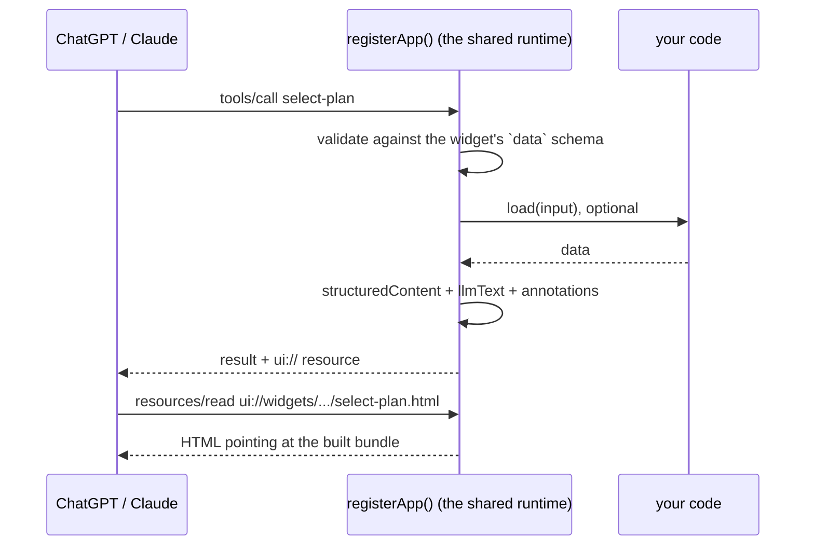

# @waniwani/kit

**Build an MCP app as a folder.** You write tools, widgets, flows and docs into
a directory, and one CLI turns that directory into a deployable MCP server. Your
repo holds none of the plumbing: server bootstrap, transport wiring, build
configuration.

Your side of this is the distribution MCP itself, meaning the tools, the
widgets, the funnel and the content. We own everything technical underneath it,
which covers the server, the transport, bundling, the deploy files, and keeping
up with framework upgrades.

```bash
oney/                          # what you write
├── waniwani.config.ts
├── tools/check-eligibility.ts
├── widgets/select-plan/{widget.ts,ui.tsx}
├── flows/split-payment.ts
└── docs/*.md

waniwani build                 # → .waniwani/, an ordinary npm project
```

## The three packages

Three packages ship under the `@waniwani` scope. The pair people mix up is the
kit and the SDK, so start there.

| | what it is | you use it when |
|---|---|---|
| **`@waniwani/sdk`** | A **library**. Flows (typed state graphs that compile to one MCP tool), event tracking, knowledge base, chat widget. You supply the `McpServer`, the transport and the build. | You already have an MCP server, or you want one you control down to the last line, and you want funnels, tracking or KB inside it. |
| **`@waniwani/kit`** | A **framework**. Folder convention, build CLI, shared server runtime. It owns the server, the transport, the bundler and the deploy files, so your repo can hold none of them. | You want to ship an MCP app and own no plumbing. |
| **`@waniwani/cli`** | The **platform CLI**. `login`, `logout`, `switch`, `connect`. OAuth into WaniWani, bind a repo to a hosted agent, run against the hosted playground. | You want your local server wired to app.waniwani.ai. |

The dependency arrow points one way. The kit depends on the SDK, and the SDK
knows nothing about the kit. Inside a kit app, `createFlow(...)` comes from the
SDK, while `defineTool`, `defineWidget` and the server that registers them come
from the kit.

- The **SDK** leaves you writing `new McpServer(...)`, `flow.register(server)`
  and `server.connect(transport)`, plus a `tsconfig`, a bundler config and a
  Dockerfile. All of it stays yours to maintain.
- The **kit** takes that whole list off you, leaving a folder to write. One copy
  of the plumbing exists, it lives in this package, and fixing it costs one
  publish plus a dependency bump per app.

> **Bin collision, today.** `@waniwani/cli@0.1.15` also claims the `waniwani`
> binary on npm, so installing both conflicts. The plan is to absorb `login`,
> `logout`, `switch` and `connect` into this package and deprecate the other.
> See [Known gaps](#known-gaps).

## Why the kit exists

30+ MCP repos each carried their own copy of the runtime: server bootstrap,
framework wiring, Vercel adapter, Express error handling, `tsconfig`, Vite
config, Dockerfile. Fixing one runtime bug meant touching all 30 repos and
reviewing all 30 changes, which is why six or seven known bugs sat unfixed.

With the runtime in a package, a fix costs one publish and one dependency bump.
An app repo receives it without changing a line of its own source.

## How it works



Every command runs four stages:

1. **scan** walks the folder and turns convention into a manifest. A tool takes
   its name from its filename and a widget takes its name from its folder, so
   nothing has to be registered by hand and no widget can sit defined and
   unwired.
2. **check** validates structure from the filesystem, then imports every
   server-safe module for real. A flow that fails to compile fails the build, as
   does a missing default export or a `showWidget("typo")`.
3. **codegen** resolves the distribution template at a pinned SHA, copies its
   plumbing byte for byte, generates registration and view entries from the
   manifest, and copies your source under `src/app/`.
4. **run** hands the result to Skybridge's `dev`, `build` or `start`, with the
   output rewritten in WaniWani's voice.

### What a request does



Every arrow that leaves `App` out is runtime code. Error envelopes, annotation
defaults (including the `title` Claude's Connectors Directory requires), the
"do not narrate the widget" instruction, the CSP block and tracking via
`withWaniwani` all sit in one place, for every app.

## The folder convention

```
oney/
├── waniwani.config.ts          defineApp({ name, title, instructions })
├── tools/
│   └── check-eligibility.ts    export default defineTool({ ..., run })
├── widgets/
│   └── select-plan/
│       ├── widget.ts           export default defineWidget({ ..., data })
│       └── ui.tsx              export default function Component()
├── flows/
│   └── split-payment.ts        export default createFlow(...).compile()   ← SDK
├── docs/
│   ├── fees.md                 becomes the `search_docs` tool
│   └── eligibility.md
└── lib/                        anything else is just modules
```

The app folder imports `@waniwani/kit`, plus `@waniwani/sdk` when it uses flows,
and nothing else. Skybridge, transports and build configuration all stay outside
it.

### Why a widget is two files

`widget.ts` gets imported by the server and by the browser bundle, so it stays
free of React and CSS. It carries one `data` schema, which serves as the tool's
input schema, its structured output, and the type the component receives:

```ts
// widgets/select-plan/widget.ts
export default defineWidget({
  title: "Choose an instalment plan",
  description: "Show the instalment plan picker. …",
  data: { amount: z.number(), plans: z.array(plan) },
  llmText: (data) => `… ${data.plans.length} plans …`,
});
```

```tsx
// widgets/select-plan/ui.tsx
const { data } = useWidget(widget); // typed off `data`, no generated helpers
```

The usual approach puts `generateHelpers<AppType>()` in a shared file typed
against the server, which makes a widget's type depend on the server's shape.
Here the widget owns its own contract, so the two cannot drift.

### Styling is Tailwind, and only Tailwind

A widget styles itself with utility classes in its `ui.tsx`. There is no
`styles.css` at any level of an app folder, and nothing imports one:

```tsx
<span className="text-xs font-bold tracking-wide text-ink-muted dark:text-slate-400">
```

`text-ink-muted` is not a Tailwind default. It comes from the distribution
template's `src/index.css`, which is the Tailwind entry and the design system in
one file:

```css
@import "tailwindcss";

/* The host hands the colour scheme to the view rather than to the browser, so
   `dark:` hangs off a class instead of `prefers-color-scheme`. */
@custom-variant dark (&:where(.dark, .dark *));

@theme {
  --font-sans: "Inter", system-ui, sans-serif;
  --color-ink: #0a1334;
  --color-ink-muted: #5a628a;
  --color-surface: #ffffff;
}
```

Every entry under `@theme` becomes a utility, so `--color-ink` gives you
`text-ink` and `bg-ink`. Rebranding every app on the template is a matter of
editing those four values in the template repo. The generator writes one import
of that file into each `src/views/<widget>.tsx` entry, and since each view is its
own bundle, Tailwind emits only the utilities that view's source actually uses.

Two details the kit handles so an app author does not have to:

- **The `dark` class.** A view is mounted alone in its own iframe, so there is no
  shared ancestor to hang the variant off. Each widget puts the class on its own
  root, driven by the theme the host reports:

  ```tsx
  const { theme } = useLayout();
  return <div className={theme === "dark" ? "dark" : ""}>…</div>;
  ```

- **The stylesheet's origins.** `src/index.css` pulls Inter from Google Fonts,
  and a host that enforces the widget CSP drops undeclared requests without
  erroring — the font just falls back and the widget looks subtly wrong. Codegen
  reads the origins off the stylesheet and the runtime merges them into every
  widget's `resourceDomains`, alongside whatever the widget declares itself.
  `fonts.googleapis.com` brings `fonts.gstatic.com` with it, since the second is
  only reachable by following the first.

Dropping app-level CSS is what makes this hold together. Tailwind v4 rejects
`@apply` in any file that has not imported Tailwind itself:

```
Cannot apply unknown utility class `text-ink`. Are you using CSS modules or
similar and missing `@reference`?
```

Fixing that from an app folder means writing a `@reference` at a path into the
generated tree, which does not exist in the author's own repo. One place for a
class name beats two, so the build check names a stray `styles.css` rather than
letting it sit there doing nothing:

```
  widgets/select-plan/styles.css
  └ app CSS is not bundled — nothing imports this file
    style with Tailwind utility classes in ui.tsx; the template's src/index.css
    carries the @theme tokens and the `dark` variant
```

## Commands

```bash
cd examples/oney
bun run check      # validate the folder
bun run dev        # generate + dev server + regenerate on change
bun run build      # generate + production build
bun run start      # run the production build
bun run deploy     # generate + vercel deploy
bunx waniwani eject [--out dir]   # hand the plumbing over and step out
```

`dev` watches the app folder, mirrors changes into `.waniwani/`, and leaves
nodemon and Vite HMR to do the rest. An edit to `tools/check-eligibility.ts`
reaches the MCP endpoint in about a second.

### What the build check catches

Errors that would otherwise surface as a 500 at request time, or as a widget
that silently never renders:

```
✗ Build check failed

  widgets/broken
  └ missing widget.ts
    every widget folder needs a widget.ts with `export default defineWidget({ ... })`

  flows/split-payment.ts
  └ showWidget references the widget "select-plans", which does not exist
    known widgets: broken, select-plan
```

Structure comes from the filesystem. The rest comes from importing every
server-safe module, so a runtime configuration mistake surfaces at build time
too:

```
  flows/no-store.ts
  └ failed to load
    [waniwani] createFlow "no_store": no flow store configured. …
```

### One CLI does the talking

The generated project runs on [Skybridge](https://www.npmjs.com/package/skybridge),
whose CLI narrates itself: a branded banner on `dev`, `build` and `start`,
pointers at its own hosted tunnel and playground, a support link, and an
analytics event per command. An app author is using `waniwani`, so
[cli/framework.mjs](packages/kit/cli/framework.mjs) holds all of that back at
three seams:

- **`dev`** runs Skybridge's dev command with `--plain`, which swaps its
  interactive UI for one plain line per diagnostic on stderr, then rewrites that
  stream line by line. URLs and TypeScript errors get restated in our format,
  and everything else gets dropped.
- **`build`** loads Skybridge's build steps, which are plain data behind its UI,
  and drives them here while printing progress itself. When that list fails to
  load it shells out to Skybridge's own build command, so a self-narrating build
  still happens.
- **`start`** prints its banner with ordinary `console.log`, so stdout gets
  rewritten the same way as dev's stderr.

What comes out is `waniwani`'s: the wordmark from `waniwani login` over a ramp
derived from the brand accent `#04d916`, then the build check and the endpoints.
The wordmark is the login CLI's art at half height, its six rows of full blocks
folded two-into-one with `▀`/`▄`/`█`, which keeps the letterforms exactly at a
cost of three lines instead of six. Colour is 24-bit where the terminal
announces it and the nearest 256-colour cube entries otherwise, both computed
from the accent, so art and ramp cannot drift. A terminal that is narrow, piped,
in CI, or running `NO_COLOR` gets the wordmark on one line.

Telemetry is off by both switches Skybridge honours, on every subprocess.
Details of the plumbing itself, such as which template resolved, how many files
it copied and which dependencies the runtime overrode, print as diagnostics
under `WANIWANI_DEBUG=1`.

None of this hides Skybridge. It sits in `package.json` like any other
dependency, the generated project names it in its `tsconfig`, and
`waniwani eject` hands over a repo openly built on it. Only prose changes:
module specifiers, the telemetry variable and the patterns that have to match
Skybridge's own strings all stay as they are.

One coupling is worth knowing about. `build` reaches into Skybridge's build-step
module by absolute path, since that module sits outside the package's `exports`
map. Skybridge's `bin` is already coupled the same way, against a version
codegen pins exactly. A shape change there costs the formatting and leaves the
build working.

## Eject

`waniwani eject` writes the plumbing into the repo itself and leaves. What comes
out is the same tree a build was producing all along, with your source moved
under `src/app/`:

```
oney/
├── src/app/{tools,widgets,flows,docs,lib}/   your code, moved
├── src/_runtime/                             the runtime, vendored as source
├── src/{server,waniwani,docs}.ts             entry, registration, inlined docs
├── src/views/<widget>.tsx                    view entries
├── vite.config.ts  vercel.json  alpic.json   bundling and deploy
├── Dockerfile  .dockerignore                 container deploy
└── tsconfig.json  package.json
```

Every `@waniwani/kit` import gets rewritten to `./_runtime/…`, and the
dependency drops out of `package.json`. From then on the repo runs on
Skybridge's own CLI (`dev`, `build`, `start`) with no WaniWani in the loop.

Ejecting in place moves the files instead of copying them, so the originals go
once the copy is on disk and the repo is never left holding two versions of a
file that can drift. `eject --out <dir>` leaves the source repo untouched.
Either way the CLI prints what moved. Eject refuses to overwrite existing
plumbing unless you pass `--force`, and it runs one way, with nothing to turn an
ejected repo back.

### Why the source moves

Skybridge compiles with `rootDir` pinned to `${configDir}/src` and emits an
entry wrapper next to the output that does a literal
`await import("./server.js")`. Source at the repo root falls outside `rootDir`
and does not compile:

```
src/waniwani.ts(8,35): error TS6059: File '…/tools/check-eligibility.ts' is not
under 'rootDir' '…/src'. 'rootDir' is expected to contain all source files.
```

Widening `rootDir` to `.` compiles, and then `tsc` emits `dist/src/server.js`
where the wrapper cannot find it, giving `ERR_MODULE_NOT_FOUND` at startup. So
the compiled server has to land at `dist/server.js`, which means every input has
to sit under `src/`. Both layouts share `appDir: "src/app"` for that reason,
which also deleted the last of the two-layout branching: one `include`, one
biome scope, and no generated `nodemon.json`, since Skybridge's default watch of
`src` already covers the tree.

### The trade eject makes

What an ejected repo gives up is the generator, and with it:

- **the build check**, so `showWidget("typo")` becomes a runtime failure again
- **name-from-filesystem**, so adding a widget means editing `src/waniwani.ts`
  and adding an entry under `src/views/`
- **docs auto-scan**, since `src/docs.ts` is a snapshot and new `docs/*.md` need
  hand-wiring
- **runtime fixes**, since `src/_runtime/` is a fork from the moment it lands

## The template stays a separate repo

`WaniWani-AI/mcp-distribution-template` is consumed as-is at build time, at a
pinned commit. Nothing is forked into this package, so what customers deploy is
the same tree anyone can read, clone and deploy by hand.

```
template github:WaniWani-AI/mcp-distribution-template#beta @ 99e26b6 (cached)
```

The resolver downloads the repo tarball, caches it by commit SHA under
`~/.cache/waniwani/templates/`, and records what it used in
`.waniwani/.template.json`. A dev loop resolves once at startup and leaves the
network alone from then on.

```bash
waniwani build                                          # pinned default
waniwani build --template github:OWNER/REPO#v2.0.0      # a tag or SHA
waniwani build --template ../mcp-distribution-template  # a local clone
WANIWANI_TEMPLATE=... waniwani build                    # or via the environment
```

### What comes from where

| From the template, byte for byte | Generated from your app |
|---|---|
| `vite.config.ts` | `src/waniwani.ts` (registration) |
| `src/server.ts` (the entry, which calls `registerApp`) | `src/docs.ts` (inlined docs) |
| `src/index.css` (Tailwind entry and design tokens) | `src/views/*.tsx` (view entries) |
| `vercel.json`, `alpic.json` | `src/app/**` (your source, copied) |
| `Dockerfile`, `.dockerignore`, `.nvmrc` | `.vercelignore` |
| `package.json` → deps and scripts | |
| `tsconfig.json` → compiler options | |

The template's own registration, example tools and widgets stay behind, since
those are the parts an app replaces. `REQUIRED` is `vite.config.ts`,
`package.json`, `tsconfig.json` and `src/index.css`. The seam the template has
to call is `registerApp` in `src/server.ts`; when that call goes missing the
build still succeeds and the server still starts, serving the template's tools
under the template's name, which is why a missing seam fails the build. The
stylesheet is required for the same reason in a different register: without it
the build stays green and every widget renders with every utility class in its
`ui.tsx` resolving to nothing.

### Failure modes are loud

```
✗ the template at github:WaniWani-AI/mcp-distribution-template#beta has no vite.config.ts
  — its layout moved and the generator needs updating
```

A bad ref gets reported as a bad ref, and the cache stays out of it:

```
✗ GitHub returned 422 for WaniWani-AI/mcp-distribution-template@nope
```

An unreachable network falls back to the newest cached copy, and says so.

### The runtime's overrides are visible

The template's `package.json` is the source of truth for dependencies. The
runtime layers decisions on top and reports every one, which puts the fleet-wide
fix mechanism in the build output:

```
runtime overrides on top of the template
  · skybridge → 1.4.0
    the template's range floats within 1.x; the runtime is built and verified against this one
  · @waniwani/sdk → ^0.19.5
    flows and tracking need the current SDK
  · tsx + ^4.20.6      the dev command shells out to tsx
  · nodemon + ^3.1.10  the dev command imports nodemon
```

**Pinned** packages are forced. **Ensured** packages get added only when absent,
so a template shipping a newer `tsx` keeps it. An app that pins a package itself
wins, and the disagreement is flagged. Scripts get the same treatment in both
directions: a `typecheck` script is added when missing, and a script pointing at
files an app does not have (`kb:ingest`, which serves the template's own
example) is dropped, since it would otherwise land in every project as a command
that fails when run.

Every line here concerns the plumbing, so `dev` and `build` print it only under
`WANIWANI_DEBUG=1`. `eject` always prints it in full, because at that point the
plumbing becomes the app's to maintain.

### Fixes the template repo wants

Overrides that exist because of something worth fixing upstream, at which point
the override lines disappear:

- `tsx` and `nodemon` are undeclared dependencies of Skybridge's dev command. It
  spawns `tsx src/server.ts` under nodemon and imports nodemon directly, while
  declaring neither.
- The Skybridge range floats within `1.x`, while the generated code is built
  against one version. Pin it.

### Catching drift where it happens

[ci/template-contract.yml](ci/template-contract.yml) lives in the template repo.
On every pull request into `beta` it builds the example app against that
branch's template, serves it, calls every tool, then ejects and builds again
with no WaniWani tooling. A layout change that would break the generator fails
the template's own CI, ahead of any customer deploy.

## Repo layout

```
packages/kit/
├── src/index.ts     defineApp / defineTool / defineWidget, the authoring API
├── src/server.ts    registerApp(), the shared runtime and the one place to fix bugs
├── src/web.tsx      useWidget() and the re-exported framework hooks
└── cli/             index · template · scan · validate · codegen · framework · log
examples/oney/       an example app: 1 widget, 1 tool, 1 flow, 2 docs
scripts/probe.mjs    exercise a running MCP server without a chat client
ci/                  a workflow for the template repo
```

## Verified

```
bun run check     ✓ 1 widget, 1 tool, 1 flow, 2 docs
bun run build     ✓ views bundled, server compiled, assets copied
bun run start     ✓ MCP on /mcp
node scripts/probe.mjs http://localhost:PORT/mcp
                  ✓ initialize, tools/list, tools/call, resources/read
```

The emitted stylesheet was read to confirm Tailwind resolves the app's classes
rather than merely running: `text-ink` and `text-ink-muted` compile from the
template's `@theme`, the `dark:` utilities compile against `.dark` rather than
`prefers-color-scheme`, and Inter is imported. `resources/read` returns the
widget CSP with `fonts.googleapis.com` and `fonts.gstatic.com` in
`resourceDomains`. Dropping a `styles.css` into the app folder fails
`waniwani check` at both the root and widget levels.

The generated project was copied outside the workspace, installed with a plain
`npm install`, built and served, so it depends on nothing but published
packages. `.waniwani/` is an ordinary npm project carrying a `vercel.json`,
which is what lets `vercel deploy` inside it work with no special support.

Eject was verified end to end from a real tarball install with bun off the
`PATH`: eject in place, `npm install`, `npm run build`, `npm run start`, and
`tools/list` returning every tool. Also verified with `--out` to a fresh
directory, where a plain `npm install && npm run build` produced the same
Tailwind output as the generated build.

## Known gaps

- **`@waniwani/cli` still owns the `waniwani` bin on npm.** It publishes
  `login`, `logout`, `switch`, `connect` and a `dev` of its own at `0.1.15`. The
  plan is to absorb those commands here and deprecate it. Until then, installing
  both collides.
- **No `waniwani init`.** Scaffolding a new app folder is manual, which is the
  last thing standing between "installable" and "usable by a stranger".
- **Deploy is wired but unrun.** `waniwani deploy` shells out to `vercel deploy`
  in the generated project, and nobody has pointed it at a real Vercel account.
- **`useWidget` does not track yet.** The next step is emitting `widget_render`
  and click events through `useWaniwani` automatically, so tracking stops being
  something each app remembers to add.
- **Docs search is a term-match** rather than the hosted KB. Swapping it for
  `wani.kb.search` when `WANIWANI_API_KEY` is set is a runtime change only.
- **The default template ref is `beta`**, a branch, and a moving one. The
  generator supports Skybridge's `src/` layout, which is what `beta` carries.
  Reproducible builds want a tag, and the resolver already pins by SHA.
- **`ci/template-contract.yml` runs, and is red.** The copy here is the source;
  the live one is in the template repo, on the `ci/template-contract` pull
  request into `beta`. Build, serve, probe and eject all pass. The Tailwind
  assertion does not, and the reason is not the template: the workflow checks
  this workspace out of `WaniWani-AI/kit`, and that repo is behind what is on
  disk here — different `codegen.mjs`, `scan.mjs`, `validate.mjs`, `server.ts`
  and example `ui.tsx`, and it still carries a `widgets/select-plan/styles.css`
  this workspace has dropped. The older generator emits no `dark:` utilities, so
  the check fails on a generator nobody is running. **This folder is not a git
  repo**, which is what let the two drift. Pushing it to `WaniWani-AI/kit` is
  the fix, and until then the contract guards the wrong thing.

## Publishing

The package is `@waniwani/kit@0.0.1` and is unpublished. What an installed copy
needs, all of which is in place:

- **`dist/` is what resolves.** `exports` points at built JavaScript and `.d.ts`,
  because Node refuses to strip types for files under `node_modules/`, giving
  `ERR_UNSUPPORTED_NODE_MODULES_TYPE_STRIPPING`. A workspace symlink hides this
  completely: the realpath lands outside `node_modules`, type stripping applies,
  and everything works right up until the first real install.
- **`src/` still ships**, as the readable source `waniwani eject` vendors.
- **`tsx`, `typescript` and the `@types` packages are runtime dependencies.**
  Skybridge shells out to `tsc` and `tsx` by bare name and resolves types from
  the app repo's tree, while declaring none of them. An app repo owns no build
  config, so this package is the only thing that can put them there.
- **The CLI runs under `node`.** It registers tsx's resolver before importing
  app modules, because app source uses the `.js` specifiers TypeScript requires
  and Node's type stripping leaves them unremapped.

Verified by packing a tarball, installing it into an empty directory with bun
off the `PATH`, building the example app, and probing the running server:

```
npm pack && npm i ../waniwani-kit-0.0.1.tgz
waniwani build     ✓ views bundled, server compiled, Vercel output emitted
waniwani start     ✓ MCP on /mcp, tools/list returns 200
```
