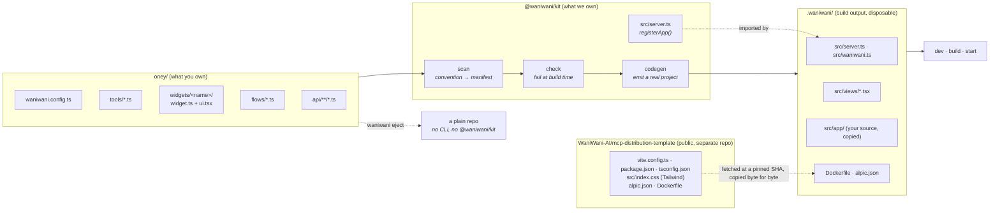
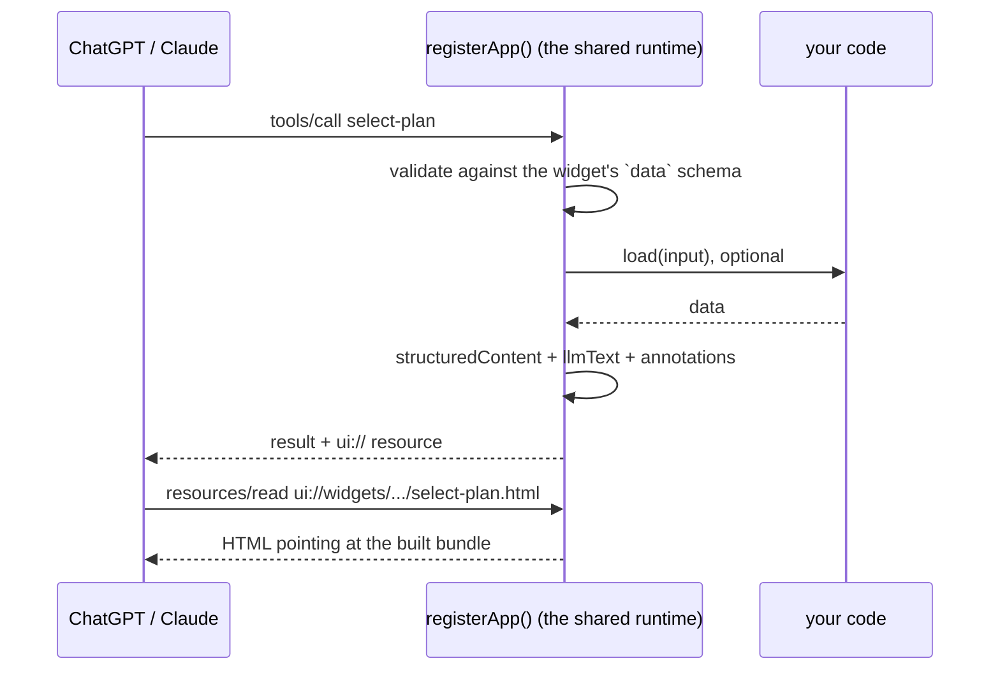

# @waniwani/kit

**Build an MCP app as a folder.** You write tools, widgets and flows into
a directory, and one CLI turns that directory into a deployable MCP server. Your
repo holds none of the plumbing: server bootstrap, transport wiring, build
configuration.

Your side of this is the distribution MCP itself, meaning the tools, the
widgets, the funnel and the content. We own everything technical underneath it,
which covers the server, the transport, bundling, the deploy files, and keeping
up with framework upgrades.

```bash
oney/                          # what you write
├── waniwani.config.ts
├── tools/check-eligibility.ts
├── widgets/select-plan/{widget.ts,ui.tsx}
└── flows/split-payment.ts

waniwani build                 # → .waniwani/, an ordinary npm project
```

The machinery underneath is in [INTERNALS.md](INTERNALS.md): template
resolution, dependency overrides, CLI output, publishing, the full gap list.

## The three packages

Three packages ship under the `@waniwani` scope. The pair people mix up is the
kit and the SDK, so start there.

| | what it is | you use it when |
|---|---|---|
| **`@waniwani/sdk`** | A **library**. Flows (typed state graphs that compile to one MCP tool), event tracking, knowledge base, chat widget. You supply the `McpServer`, the transport and the build. | You already have an MCP server, or you want one you control down to the last line, and you want funnels, tracking or KB inside it. |
| **`@waniwani/kit`** | A **framework**. Folder convention, build CLI, shared server runtime. It owns the server, the transport, the bundler and the deploy files, so your repo can hold none of them. | You want to ship an MCP app and own no plumbing. |
| **`@waniwani/cli`** | The **platform CLI**. `login`, `logout`, `switch`, `connect`. OAuth into WaniWani, bind a repo to a hosted agent, run against the hosted playground. | You want your local server wired to app.waniwani.ai. |

### Kit against SDK, in code

With the SDK, the server is a file you write and keep:

```ts
// src/server.ts, yours to maintain
import { McpServer } from "@modelcontextprotocol/sdk/server/mcp.js";
import { StreamableHTTPServerTransport } from "@modelcontextprotocol/sdk/server/streamableHttp.js";

const server = new McpServer({ name: "oney", version: "1.0.0" });

server.registerTool(
  { name: "check-eligibility", title, description, inputSchema, annotations },
  async (input) => { /* … */ },
);
await flow.register(server);
await server.connect(new StreamableHTTPServerTransport(/* … */));
```

Around that file you also own a `tsconfig.json`, a bundler config for any widget
UI, a `Dockerfile` and the deploy config each host wants.

With the kit, you write the part that answers the question and nothing around
it:

```ts
// tools/check-eligibility.ts
export default defineTool({ title, description, input, output, hints, run });
```

The kit finds that file, derives its tool name, registers it, bundles any widget
that goes with it, and emits a deployable project. One copy of the plumbing
exists, it lives in this package, and fixing it costs one publish plus a
dependency bump per app.

The dependency arrow points one way. The kit depends on the SDK, and the SDK
knows nothing about the kit. Inside a kit app, `createFlow(...)` comes from the
SDK, while `defineApp`, `defineTool`, `defineWidget` and the server that
registers them come from the kit.

> **Bin collision, today.** `@waniwani/cli@0.1.15` also claims the `waniwani`
> binary on npm, so installing both conflicts. The plan is to absorb `login`,
> `logout`, `switch` and `connect` into this package and deprecate the other.
> See [Status](#status).

## Quickstart

```bash
npx @waniwani/kit init oney
cd oney && npm run dev
```

`init` writes a folder that already answers: an app config, one tool, and the
widget that displays what the tool returned. It installs, and the dev
server is one command away. Running it inside an existing repo merges into that
repo's `package.json` and `.gitignore` instead of replacing them.

In a terminal it asks three questions, arrow keys and Enter:

```
┌  A new MCP app
│
◇  App name
│  oney
│
◆  What should it come with?
│  ● A tool and a widget (the hand-off between them, wired up)
│  ○ Just a tool
│  ↑/↓ to navigate • Enter: confirm
└
```

Every question has a flag that answers it ahead of time (`--name`, `--minimal`,
`--host`), and a question whose answer is already in hand is not asked. `--yes`
takes every default and asks nothing, which is also what happens where there is
no terminal to ask in: a pipe, or CI.

Where the app lands follows the argument. `init oney` creates `oney/`, `init .`
uses the current folder, and a bare `init` asks for a name and reads the answer
as both: a name of its own creates `./<name>/`, while the offered default, your
current folder's name, scaffolds in place.

The rest of this section is what those files hold, written out by hand.
[examples/oney](examples/oney) is the same app finished, if you would rather read
it than type it.

```bash
mkdir oney && cd oney
npm init -y
npm i @waniwani/kit @waniwani/sdk react react-dom zod
```

Set `"type": "module"` and the scripts:

```json
{
  "scripts": {
    "check": "waniwani check",
    "dev": "waniwani dev",
    "build": "waniwani build",
    "start": "waniwani start"
  }
}
```

**1. Name the app and tell the model how to behave.**

```ts
// waniwani.config.ts
import { defineApp } from "@waniwani/kit";

export default defineApp({
  name: "oney",
  title: "Oney: split your payment",
  instructions: `You help shoppers split a purchase into instalments with Oney.

RULES:
- Never quote a monthly amount yourself. Call check-eligibility and let it do the arithmetic.
- Never list the plans in text. Show the select-plan widget and let it render them.`,
});
```

`instructions` reaches the host LLM once, before any tool call.

**2. Write a tool.** The filename becomes the tool name.

```ts
// tools/check-eligibility.ts
import { defineTool } from "@waniwani/kit";
import { z } from "zod";
import { buildPlans } from "../lib/plans.js";

export default defineTool({
  title: "Check instalment eligibility",
  description:
    "Work out which instalment plans a basket qualifies for. Call this before showing any plans, and before quoting any figure.",
  input: {
    amount: z.number().positive().describe("Basket total in euros, e.g. 249.90"),
    country: z.enum(["FR", "ES", "PT"]).default("FR"),
  },
  output: {
    eligible: z.boolean(),
    plans: z.array(z.object({ id: z.string(), monthly: z.number(), fee: z.number() })),
  },
  hints: { readOnly: true },
  run: ({ amount, country }) =>
    amount < 50
      ? { eligible: false, plans: [] }
      : { eligible: true, plans: buildPlans(amount, country) },
});
```

`input` and `output` are Zod shapes, written as plain objects rather than
`z.object({ … })`. `hints` becomes MCP annotations, with the runtime filling in
the `title` that Claude's Connectors Directory requires.

**3. Write a widget.** The folder name becomes the tool name, and the widget
takes two files.

```ts
// widgets/select-plan/widget.ts
import { defineWidget } from "@waniwani/kit";
import { z } from "zod";

const plan = z.object({
  id: z.string(),
  label: z.string().describe("Short label, e.g. '3×'."),
  monthly: z.number(),
  fee: z.number(),
});

export default defineWidget({
  title: "Choose an instalment plan",
  description:
    "Show the instalment plan picker. Call this once check-eligibility has returned plans, passing them straight through. The widget renders every figure itself: do NOT list the plans in text.",
  data: {
    amount: z.number(),
    plans: z.array(plan).describe("Plans returned by check-eligibility, unmodified."),
  },
  llmText: (data) =>
    `The picker is on screen with ${data.plans.length} plans. Wait for the user to pick one.`,
});
```

```tsx
// widgets/select-plan/ui.tsx
import { useSendFollowUpMessage, useWidget } from "@waniwani/kit/web";
import widget from "./widget.js";

export default function SelectPlan() {
  const { data } = useWidget(widget);
  const sendFollowUp = useSendFollowUpMessage();
  if (!data) return <div className="font-sans text-ink-muted">Loading your plans…</div>;

  return (
    <div className="font-sans text-ink">
      {data.plans.map((plan) => (
        <button
          key={plan.id}
          type="button"
          onClick={() => sendFollowUp(`I'll take the ${plan.label} plan.`)}
        >
          {plan.label}: €{plan.monthly}/month
        </button>
      ))}
    </div>
  );
}
```

**4. Run it.**

```bash
npm run dev
```

`dev` watches the folder, mirrors changes into `.waniwani/`, and leaves nodemon
and Vite HMR to do the rest. An edit to `tools/check-eligibility.ts` reaches the
MCP endpoint in about a second. Point a client at `/mcp`, or run
[scripts/probe.ts](scripts/probe.ts) against it to exercise the server without
a chat client.

## The folder convention

```
oney/
├── waniwani.config.ts          defineApp({ name, title, instructions })
├── tools/
│   └── check-eligibility.ts    export default defineTool({ ..., run })
├── widgets/
│   └── select-plan/
│       ├── widget.ts           export default defineWidget({ ..., data })
│       └── ui.tsx              export default function Component()
├── flows/
│   └── split-payment.ts        export default createFlow(...).compile()   ← SDK
├── api/
│   └── cal/slots.ts            export default defineEndpoint({ ..., handler })
└── lib/                        anything else is just modules
```

Names come from the filesystem, verbatim. `tools/check-eligibility.ts` registers
as `check-eligibility`, and `widgets/select-plan/` registers as `select-plan`.
Nothing has to be listed in a registry, so no widget can sit defined and
unwired.

| folder | becomes | notes |
|---|---|---|
| `tools/<name>.ts` | one MCP tool | `.ts`, `.tsx` and `.mts` are picked up |
| `widgets/<name>/` | one MCP tool plus a `ui://` resource | needs `widget.ts` and `ui.tsx` |
| `flows/<name>.ts` | one MCP tool, registered from the SDK unchanged | whatever `.compile()` returns |
| `api/<path>.ts` | one HTTP endpoint at `/api/<path>` | for the browser, invisible to the model |
| anything else | plain modules | the CLI leaves it alone |

The app folder imports `@waniwani/kit`, plus `@waniwani/sdk` when it uses flows,
and nothing else. Skybridge, transports and build configuration all stay outside
it.

### Why a widget is two files

`widget.ts` gets imported by the server and by the browser bundle, so it stays
free of React and CSS. It carries one `data` schema, which serves as the tool's
input schema, its structured output, and the type the component receives:

```ts
// widgets/select-plan/widget.ts
export default defineWidget({
  title: "Choose an instalment plan",
  description: "Show the instalment plan picker. …",
  data: { amount: z.number(), plans: z.array(plan) },
  llmText: (data) => `… ${data.plans.length} plans …`,
});
```

```tsx
// widgets/select-plan/ui.tsx
const { data } = useWidget(widget); // typed off `data`, no generated helpers
```

The usual approach puts `generateHelpers<AppType>()` in a shared file typed
against the server, which makes a widget's type depend on the server's shape.
Here the widget owns its own contract, so the two cannot drift.

`data` arrives as soon as the host has the tool input, which on most hosts
happens before the server responds, so render optimistically and reach for
`isReady` when you need the final value.

### Flows come from the SDK

A flow is an SDK primitive used unchanged. `createFlow(...).compile()` returns
something the runtime registers directly, with no wrapper and no adapter, so
everything the SDK documents about flows applies here as written.

```ts
// flows/split-payment.ts
import { createFlow, END, MemoryKvStore, START } from "@waniwani/sdk/mcp";

export default createFlow({ id: "split_payment", title, description, state })
  .addNode({
    id: "ask_amount",
    run: ({ interrupt }) => interrupt({ amount: { question: "How much is the basket?" } }),
  })
  .addNode({
    id: "show_plans",
    run: ({ state, showWidget }) =>
      showWidget({ tool: "select-plan", field: "selectedPlanId", data: { /* … */ } }),
  })
  .addEdge(START, "ask_amount")
  .addEdge("ask_amount", "show_plans")
  .addEdge("show_plans", END)
  .compile({ store: new MemoryKvStore() });
```

`showWidget({ tool: "select-plan" })` names a widget by its folder name, and the
build check verifies that the folder exists.

### Which SDK version an app gets

`@waniwani/sdk` is a peer rather than a pin. The app's own `package.json` names
the version, and this package states only the floor underneath it, so an app
that upgrades keeps that choice through every build. Nothing here rewrites the
range.

`waniwani init` writes the newest published SDK it can reach, capped with a
caret, and falls back to the declared floor when npm is unreachable. Set
`WANIWANI_OFFLINE=1` to skip the lookup entirely.

The SDK is 0.x, where a caret stops at the next minor. `^0.19.9` picks up
0.19.10 on the next install and never crosses to 0.20 on its own. When a newer
minor is published, `waniwani check` says so and names the one-line edit; taking
it is the app's call, since under 0.x a minor is a breaking change.

### The api/ folder is for the browser

A widget runs in an iframe on another origin, and it can call its own server
without going through the model at all. Booking a slot, loading a calendar,
receiving a webhook: `api/` is where those live. The path comes from the file's
position, the folder name included, so there is nothing to keep in step with the
`fetch()` on the other side:

```
api/cal/slots.ts          →  /api/cal/slots
api/webhooks/stripe.ts    →  /api/webhooks/stripe
api/cal/index.ts          →  /api/cal
```

```ts
// api/cal/slots.ts
import { defineEndpoint } from "@waniwani/kit";
import { fetchCalSlots } from "../../lib/cal.js";

export default defineEndpoint({
  method: "post",
  handler: async (req, res) => {
    const { timeZone } = req.body;
    res.json({ slots: await fetchCalSlots(regionFor(timeZone)) });
  },
});
```

The widget reaches it at the origin the host hands the view, which is the dev
port locally and the deployed origin inside ChatGPT or Claude:

```tsx
const apiUrl = (path: string) => `${window.skybridge?.serverUrl ?? ""}${path}`;
const response = await fetch(apiUrl("/api/cal/slots"), { method: "POST", body });
```

Four things arrive with every endpoint, so no app writes them:

| | what the runtime does |
|---|---|
| **CORS** | on by default, preflight included, advertising the methods `method` declares and no others |
| **JSON body** | `express.json()`, because the framework installs no parser of its own and `req.body` would be `undefined` |
| **method guard** | anything outside `method` gets a 405 and an `Allow` header, instead of reaching a handler written for a POST |
| **errors** | a handler that throws answers JSON with the message, logged as `[waniwani] endpoint "/api/..." failed`, so a `fetch()` waiting on JSON never receives an HTML error page |

`cors: false` and `json: false` opt out of the first two. Leaving `method` off
accepts every method.

**Reach for a tool instead when the model is the caller.** An endpoint appears in
no `tools/list`, costs no turn and no tokens, and the model cannot see that it
happened. That is what suits a calendar the widget paints for itself, and what
rules it out for anything the model has to reason about or quote back.

Endpoints share the process with `/mcp`, so `lib/` is one set of modules for
both, and the build check prints what it mounted:

```
✓ Build check passed — 1 widget, 1 flow, 2 endpoints
  widget show-book-call
  flow   demo-qualification
  api    /api/cal/book
  api    /api/cal/slots
```

### Styling is Tailwind, and only Tailwind

A widget styles itself with utility classes in its `ui.tsx`. There is no
`styles.css` at any level of an app folder, and nothing imports one:

```tsx
<span className="text-xs font-bold tracking-wide text-ink-muted dark:text-slate-400">
```

`text-ink-muted` is not a Tailwind default. It comes from the distribution
template's `src/index.css`, which is the Tailwind entry and the design system in
one file:

```css
@import "tailwindcss";

/* The host hands the colour scheme to the view rather than to the browser, so
   `dark:` hangs off a class instead of `prefers-color-scheme`. */
@custom-variant dark (&:where(.dark, .dark *));

@theme {
  --font-sans: "Inter", system-ui, sans-serif;
  --color-ink: #0a1334;
  --color-ink-muted: #5a628a;
  --color-surface: #ffffff;
}
```

Every entry under `@theme` becomes a utility, so `--color-ink` gives you
`text-ink` and `bg-ink`. Rebranding every app on the template is a matter of
editing those four values in the template repo. The generator writes one import
of that file into each `src/views/<widget>.tsx` entry, and since each view is its
own bundle, Tailwind emits only the utilities that view's source actually uses.

Two details the kit handles so an app author does not have to:

- **The `dark` class.** A view is mounted alone in its own iframe, so there is no
  shared ancestor to hang the variant off. Each widget puts the class on its own
  root, driven by the theme the host reports:

  ```tsx
  const { theme } = useLayout();
  return <div className={theme === "dark" ? "dark" : ""}>…</div>;
  ```

- **The stylesheet's origins.** `src/index.css` pulls Inter from Google Fonts,
  and a host that enforces the widget CSP drops undeclared requests without
  erroring, so the font falls back and the widget looks subtly wrong. Codegen
  reads the origins off the stylesheet and the runtime merges them into every
  widget's `resourceDomains`, alongside whatever the widget declares itself.
  `fonts.googleapis.com` brings `fonts.gstatic.com` with it, since the second is
  only reachable by following the first.

Dropping app-level CSS is what makes this hold together. Tailwind v4 rejects
`@apply` in any file that has not imported Tailwind itself:

```
Cannot apply unknown utility class `text-ink`. Are you using CSS modules or
similar and missing `@reference`?
```

Fixing that from an app folder means writing a `@reference` at a path into the
generated tree, which does not exist in the author's own repo. One place for a
class name beats two, so the build check names a stray `styles.css` rather than
letting it sit there doing nothing:

```
  widgets/select-plan/styles.css
  └ app CSS is not bundled — nothing imports this file
    style with Tailwind utility classes in ui.tsx; the template's src/index.css
    carries the @theme tokens and the `dark` variant
```

## Commands

```bash
waniwani init [dir] # scaffold an app folder, install, ready to dev
waniwani check      # validate the folder
waniwani dev        # generate + dev server + regenerate on change
waniwani build      # generate + production build
waniwani start      # run the production build
waniwani eject [--out dir]   # hand the plumbing over and step out
```

`init` writes files and stops there. Every other command runs the same four
stages before doing its own work.



1. **scan** walks the folder and turns convention into a manifest.
2. **check** validates structure from the filesystem, then imports every
   server-safe module for real.
3. **codegen** resolves the distribution template at a pinned SHA, copies its
   plumbing byte for byte, generates registration and view entries from the
   manifest, and copies your source under `src/app/`.
4. **run** hands the result to Skybridge's `dev`, `build` or `start`, with the
   output rewritten in WaniWani's voice.

`.waniwani/` is disposable and safe to delete.

### Deploying is a git push

`waniwani init` asks where the app deploys, because the answer decides the one
config file the repo carries:

```
◆  Where will this deploy?
│  ● Vercel (git push, or `vercel deploy --prebuilt`)
│  ○ Docker
│  ○ Alpic
│  ○ I don't know yet
│  ↑/↓ to navigate • Enter: confirm
└
```

Only Vercel leaves anything behind, and it is four lines:

```json
// vercel.json
{
  "$schema": "https://openapi.vercel.sh/vercel.json",
  "framework": null
}
```

`framework: null` selects the `Other` preset. That one key is the only thing a
repo cannot say any other way: the preset is a project setting Vercel resolves
*before* the build command runs, so a project whose dashboard says `Next.js` or
`Express` fails on the preset and never reaches the build. `Other` is what runs
the `build` script and adopts what the build produced.

```
Error: No Next.js version detected.
```

Nothing else belongs in that file. `waniwani build` writes a Build Output tree
inside `.waniwani/` — the bundled function, the static assets, the routing config
— and the build's last step moves it to `.vercel/output` at the app root, the one
path where Vercel adopts one. A `buildCommand` would restate the `build` script
that already runs, and a `routes` table would duplicate routing the build writes.
Both go stale against a kit that moved on; `framework: null` is a fact about the
project, so it never changes.

```bash
git push                          # a git-connected project builds and serves it
vercel deploy --prebuilt          # or upload the tree a local build produced
```

A prebuilt deploy skips the preset question entirely, since it uploads the tree
and asks Vercel to build nothing.

One thing the kit decides on the app's behalf, in that tree's own routing table:

```json
{ "src": "/api(/.*)?", "dest": "/mcp" }
```

Vercel reserves a root `api/` directory. It compiles every file under one into a
serverless function of its own, and an endpoint module is not a Vercel handler —
`defineEndpoint({ ... })` is an object. The reservation cannot be waived, since
the file list is read before the build command runs:

```
Error: File not found: /vercel/path0/api/cal/book.ts
```

So the route goes in ahead of the tree's `filesystem` handler, which is the
phase those functions sit in. `/api/*` reaches the server the kit built, and the
ones Vercel made are never routed to. They still cost build time, two dead
functions per app.

An app carrying a `vercel.json` from an earlier kit has to lose everything in it
but `framework`. Its build command stages the tree by hand, from a path the build
no longer writes to, so it deletes what the build just placed. `waniwani check`
names the keys that fight the build.

Environment variables live on the platform for both, since `.env` is read from
disk and a hosted build has no such file. A project that sets its variables for
production alone gets previews with none, which for an app whose flow reads
`WANIWANI_API_KEY` at import time means a function that fails to boot.

### Secrets live in the app's .env

`.env` and `.env.local` sit next to `waniwani.config.ts`, and every command reads
them before it runs anything. A variable already exported in the shell or set by
CI wins over both files, and a hosted deploy sets its variables on the platform
and reads no file at all.

Loading them this early is what lets a module build its client at import time:

```ts
// lib/waniwani.ts
export const wani = waniwani({ apiKey: process.env.WANIWANI_API_KEY });
```

The generated project runs from `.waniwani/`, one level below the file, and a
module's imports are evaluated before any line of the module that pulled it in,
so neither `dotenv/config` nor a load inside generated code arrives in time.
`waniwani check` reads the same files for the same reason: it imports every
server-safe module for real, and a flow whose store comes from
`WANIWANI_API_KEY` would otherwise fail its own build check over a variable
sitting in the file next to it.

### What the build check catches

Errors that would otherwise surface as a 500 at request time, or as a widget
that silently never renders:

```
✗ Build check failed

  widgets/broken
  └ missing widget.ts
    every widget folder needs a widget.ts with `export default defineWidget({ ... })`

  flows/split-payment.ts
  └ showWidget references the widget "select-plans", which does not exist
    known widgets: broken, select-plan
```

Structure comes from the filesystem. The rest comes from importing every
server-safe module, so a flow that fails to compile fails the build, as does a
missing default export, a tool with no description, or a runtime configuration
mistake:

```
  flows/no-store.ts
  └ failed to load
    [waniwani] createFlow "no_store": no flow store configured. …
```

## What a request does



Every arrow that leaves `App` out is runtime code. Error envelopes, annotation
defaults (including the `title` Claude's Connectors Directory requires), the
"do not narrate the widget" instruction, the CSP block and tracking via
`withWaniwani` all sit in one place, for every app.

One consequence worth knowing while you write a tool: a `run` that throws
returns an error envelope telling the host to offer a retry rather than invent a
result, so exceptions are safe to let propagate.

## Eject

`waniwani eject` writes the plumbing into the repo itself and leaves. What comes
out is the same tree a build was producing all along, with your source moved
under `src/app/`:

```
oney/
├── src/app/{tools,widgets,flows,lib}/        your code, moved
├── src/_runtime/                             the runtime, vendored as source
├── src/{server,waniwani}.ts                  entry and registration
├── src/views/<widget>.tsx                    view entries
├── vite.config.ts  alpic.json  vercel.json   bundling and deploy
├── Dockerfile  .dockerignore                 container deploy
└── tsconfig.json  package.json
```

Every `@waniwani/kit` import gets rewritten to `./_runtime/…`, and the
dependency drops out of `package.json`. From then on the repo runs on
Skybridge's own CLI (`dev`, `build`, `start`) with no WaniWani in the loop.

Ejecting in place moves the files instead of copying them, so the originals go
once the copy is on disk and the repo is never left holding two versions of a
file that can drift. `eject --out <dir>` leaves the source repo untouched.
Either way the CLI prints what moved. Eject refuses to overwrite existing
plumbing unless you pass `--force`, and it runs one way, with nothing to turn an
ejected repo back.

Your source has to move under `src/` for the compiled server to land where
Skybridge's entry wrapper looks for it. The `rootDir` constraint behind that is
written up in
[the internals](INTERNALS.md#why-eject-moves-the-source).

### The trade eject makes

What an ejected repo gives up is the generator, and with it:

- **the build check**, so `showWidget("typo")` becomes a runtime failure again
- **name-from-filesystem**, so adding a widget means editing `src/waniwani.ts`
  and adding an entry under `src/views/`
- **runtime fixes**, since `src/_runtime/` is a fork from the moment it lands

## Status

`@waniwani/kit@0.0.1`, unpublished. What bites an app author today:

- **`@waniwani/cli` owns the `waniwani` bin on npm**, so installing both
  collides.
- **`waniwani init` scaffolds one shape of app**, a tool with the widget that
  displays it. A flow is not among the files it writes.
- **Deploying is manual.** A build leaves a tree `vercel deploy --prebuilt`
  uploads as it is, and a git push builds it on the platform, but no command
  wraps either.
- **`init` asks where an app deploys, and nothing else does.** A transfer, or an
  app that answered `I don't know yet`, writes its own `vercel.json`.
- **`useWidget` does not track yet.** Emitting `widget_render` and click events
  through `useWaniwani` automatically is the next step.

Template pinning, the CI contract, publishing requirements and the rest of the
gap list are in [INTERNALS.md](INTERNALS.md).
