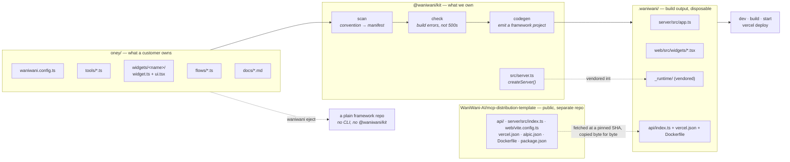
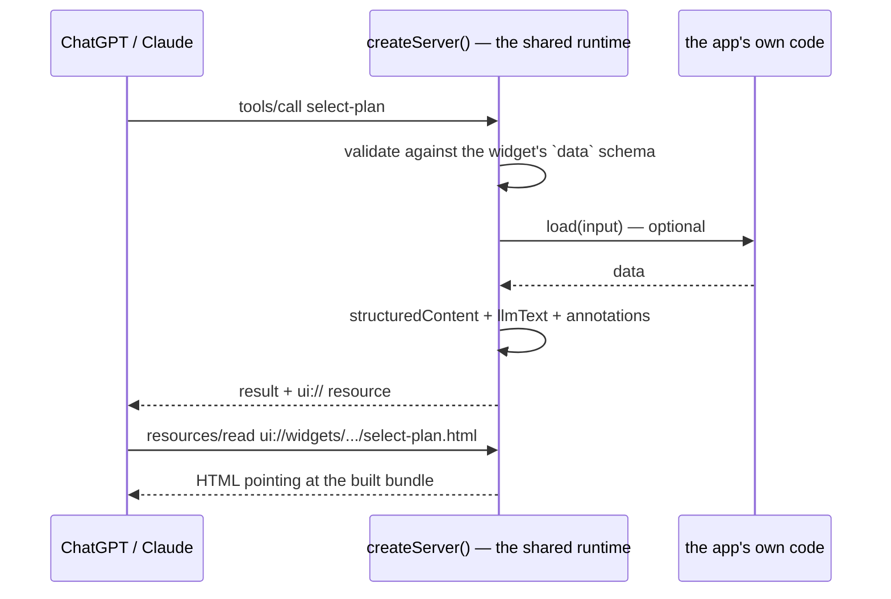

# Waniwani MCP runtime — proof of concept

An app folder, a build CLI, and one shared runtime. The app repo holds content;
everything underneath it lives in a versioned package.

This is the Mintlify-on-Next.js shape applied to MCP: customers write a folder,
`waniwani build` turns it into a complete deployable project, and that project
deploys to Vercel or any container host.

## The problem it solves

30+ MCP repos each contain their own copy of the runtime: server bootstrap,
framework wiring, Vercel adapter, Express error handling, `tsconfig`, `vite`
config, Dockerfile. A runtime bug is 30 edits, 30 reviews, 30 verifications —
which is why six or seven known bugs sit unfixed.

With the runtime in a package, a fix is one publish and one dependency bump per
app. Nothing about an app repo has to change for it to receive the fix.

## How it fits together



The app folder never imports the framework, never sees a transport, and has no
build configuration. It imports `@waniwani/kit` and nothing else.

### What a request does



Every arrow that is not `App` is runtime code. Error envelopes, annotation
defaults, the "do not narrate the widget" instruction, the CSP block, tracking
via `withWaniwani` — all of it is fixed in one place for every app.

## The folder convention

```
oney/
├── waniwani.config.ts          name, title, model instructions
├── tools/
│   └── check-eligibility.ts    export default defineTool({ ..., run })
├── widgets/
│   └── select-plan/
│       ├── widget.ts           export default defineWidget({ ..., data })
│       ├── ui.tsx              export default function Component()
│       └── styles.css          optional, bundled with the widget
├── flows/
│   └── split-payment.ts        export default createFlow(...).compile()
├── docs/
│   ├── fees.md                 becomes the `search_docs` tool
│   └── eligibility.md
└── lib/                        anything else is just modules
```

Folder name is tool name. Filename is tool name. There is no registry to keep
in sync, so a widget cannot be defined and left unregistered.

### Why a widget is two files

`widget.ts` is imported by the server *and* by the browser bundle, so it stays
free of React and CSS. It carries one `data` schema that serves as the tool's
input schema, its structured output, and the type the component receives:

```ts
// widgets/select-plan/widget.ts
export default defineWidget({
  title: "Choose an instalment plan",
  description: "Show the instalment plan picker. …",
  data: { amount: z.number(), plans: z.array(plan) },
  llmText: (data) => `… ${data.plans.length} plans …`,
});
```

```tsx
// widgets/select-plan/ui.tsx
const { data } = useWidget(widget); // typed off `data`, no generated helpers
```

The template's approach — `generateHelpers<AppType>()` in a shared file, typed
against the server — makes the widget's type depend on the server's shape.
Here the widget owns its own contract, so the two cannot drift.

## Commands

```bash
cd examples/oney
bun run check      # validate the folder
bun run dev        # generate + dev server + regenerate on change
bun run build      # generate + production build
bun run start      # run the production build
bun run deploy     # generate + vercel deploy
bunx waniwani eject [--out dir]   # hand the plumbing over and step out
```

`dev` watches the app folder, mirrors changes into `.waniwani/`, and lets
nodemon and Vite HMR do the rest — editing `tools/check-eligibility.ts` is live
on the MCP endpoint in about a second.

### One CLI does the talking

The generated project runs on a third-party MCP framework, and that framework's
CLI narrates itself: a branded banner on `dev`, `build` and `start`, pointers at
its own hosted tunnel and playground, a support link, and an analytics event per
command. An app author is using `waniwani`, so `cli/framework.mjs` holds all of
it back at three seams:

- **`dev`** runs the framework's dev command with `--plain`, which trades its
  interactive UI for one plain line per diagnostic on stderr, then rewrites that
  stream line by line. URLs and TypeScript errors are restated in our format;
  the rest is dropped.
- **`build`** loads the framework's build steps — plain data behind its UI — and
  drives them here, printing the progress itself. If that list can't be loaded it
  shells out to the framework's own build command instead: a build that narrates
  itself beats no build at all.
- **`start`** prints its banner with ordinary `console.log`, so stdout is
  rewritten the same way as dev's stderr.

What comes out is `waniwani`'s: the wordmark from `waniwani login` over a ramp
derived from the brand accent `#04d916`, then the build check and the endpoints.

The wordmark is the login CLI's art at half height — its six rows of full blocks
folded two-into-one with `▀`/`▄`/`█`, which keeps the letterforms exactly and
costs three lines instead of six. Colour is 24-bit where the terminal announces
it and the nearest 256-colour cube entries otherwise, both computed from the
accent rather than written out, so art and ramp cannot drift. A terminal that is
narrow, piped, in CI, or running `NO_COLOR` gets the wordmark on one line.

Telemetry is off by both switches the framework honours, on every subprocess.

Everything about the plumbing itself — which template was resolved, how many
files it copied, which dependencies the runtime overrode — is a diagnostic rather
than an event, and prints only under `WANIWANI_DEBUG=1`.

This is house style, not concealment: the dependency is declared in
`package.json` like any other, the generated project names it in its `tsconfig`,
and `waniwani eject` hands over a repo that is openly built on it. Module
specifiers, the telemetry variable and the patterns that have to match the
framework's own strings all stay as they are; prose does not.

One coupling to know about: `build` reaches into the framework's build-step
module by absolute path, since it sits outside the package's `exports` map. That
is the same coupling its `bin` already is, against a version codegen pins
exactly. A shape change there costs the formatting, not the build.

## Eject

`waniwani eject` writes the plumbing into the repo itself and leaves. What comes
out is the same tree a build was producing all along, with the app's source
moved under `src/app/`:

```
oney/
├── src/app/{tools,widgets,flows,docs,lib}/   your code, moved
├── src/_runtime/                             the runtime, vendored as source
├── src/{server,waniwani,docs}.ts             entry, registration, inlined docs
├── src/views/<widget>.tsx                    view entries
├── vite.config.ts  vercel.json  alpic.json   bundling and deploy
├── Dockerfile  .dockerignore                 container deploy
└── tsconfig.json  package.json
```

Every `@waniwani/kit` import is rewritten to `./_runtime/…`, and the dependency
is dropped from `package.json`. From then on it is the framework's own CLI —
`dev`, `build`, `start` — with no Waniwani in the loop.

### Why the source moves

It is the one thing eject cannot leave alone. The framework compiles with `rootDir`
pinned to `${configDir}/src` and emits an entry wrapper next to the output that
does a literal `await import("./server.js")`. Source at the repo root is outside
`rootDir` and does not compile:

```
src/waniwani.ts(8,35): error TS6059: File '…/tools/check-eligibility.ts' is not
under 'rootDir' '…/src'. 'rootDir' is expected to contain all source files.
```

Widening `rootDir` to `.` compiles, but then `tsc` emits `dist/src/server.js`
and the wrapper cannot find it — `ERR_MODULE_NOT_FOUND` at startup. So the
compiled server has to land at `dist/server.js`, so every input has to sit under
`src/`. Both layouts now share `appDir: "src/app"` for that reason, which also
deleted the last of the two-layout branching: one `include`, one biome scope, and
no generated `nodemon.json` (the framework's default watch of `src` already covers
the tree).

Ejecting in place is a **move**, not a copy — the originals are removed once the
copy is on disk, so the repo is never left holding two versions of a file that
can drift. `eject --out <dir>` leaves the source repo untouched. Either way the
CLI prints what moved. Eject refuses to overwrite existing plumbing unless
`--force`, and it is one way — nothing turns an ejected repo back.

Verified end to end from a real tarball install, bun off the `PATH`: eject in
place, `npm install`, `npm run build`, `npm run start`, `tools/list` returns all
five tools (the template's `faq` plus the app's tool, widget, flow and docs
search). Also verified with `--out` to a fresh directory.

### The trade eject makes

What an ejected repo gives up is the generator, and with it:

- **the build check** — `showWidget("typo")` becomes a runtime failure again
- **name-from-filesystem** — adding a widget means editing `server/src/app.ts`
  and adding a bundle entry under `web/src/widgets/`
- **docs auto-scan** — `server/src/docs.ts` is a snapshot; new `docs/*.md` need
  hand-wiring
- **runtime fixes** — `runtime/` is a fork from the moment it lands

## What the build check catches

Errors that would otherwise be a 500 at request time, or a widget that silently
never renders:

```
✗ Build check failed

  widgets/broken
  └ missing widget.ts
    every widget folder needs a widget.ts with `export default defineWidget({ ... })`

  flows/split-payment.ts
  └ showWidget references the widget "select-plans", which does not exist
    known widgets: broken, select-plan
```

It checks structure from the filesystem, then imports every server-safe module —
so a flow that fails to compile, a missing default export, or a tool with no
description is a build error:

```
  flows/no-store.ts
  └ failed to load
    [waniwani] createFlow "no_store": no flow store configured. …
```

## Verified end to end

```
bun run check     ✓ 1 widget, 1 tool, 1 flow, 2 docs
bun run build     ✓ widgets bundled, server compiled, assets copied
bun run start     ✓ MCP on /mcp, 4 tools, 2 widget resources
node scripts/probe.mjs http://localhost:PORT/mcp
                  ✓ initialize, tools/list, tools/call ×4, resources/read
```

The generated project was also copied outside the workspace, installed with a
plain `npm install`, built, and served — it depends on nothing but published
packages. That is the deploy story: `.waniwani/` is an ordinary npm project with
a `vercel.json`, so `vercel deploy` in it needs no special support.

`scripts/probe.mjs` exercises a running server without a chat client.

## Framework version pinning

Pinned to `0.35.17`, the version the distribution template runs.

`0.36` renames widgets to views (`registerWidget` → `registerTool({ view })`),
moves the project layout from `server/` + `web/` to a single `src/`, and inlines
the Vite manifest as a module. The distribution template declares
`">=0.35.14 <1.0.0"`, so a fresh install of the template resolves to `0.36` and
breaks — worth checking on the real repos.

That churn is the argument for this architecture in one example: absorbing it
means changing `codegen.mjs` and `server.ts`, then bumping a dependency in each
app. No app repo's source changes at all.

## Layout of this proof of concept

```
packages/waniwani-mcp/
├── src/index.ts     defineApp / defineTool / defineWidget — the authoring API
├── src/server.ts    createServer() — the shared runtime, the one place to fix bugs
├── src/web.tsx      useWidget() and the re-exported framework hooks
└── cli/             template · scan · validate · codegen ·
                     dev/build/start/deploy/eject
examples/oney/           an example app: 1 widget, 1 tool, 1 flow, 2 docs
scripts/probe.mjs    exercise a running MCP server
ci/                  a workflow for the template repo
```

## The template stays a separate repo

`WaniWani-AI/mcp-distribution-template` is consumed as-is at build time, at a
pinned commit. Nothing is forked into this package, so what customers deploy is
the same tree anyone can read, clone, and deploy by hand.

```
template github:WaniWani-AI/mcp-distribution-template#main @ 99e26b6 (cached)
```

The resolver downloads the repo tarball, caches it by commit SHA under
`~/.cache/waniwani/templates/`, and records what it used in
`.waniwani/.template.json`. A dev loop resolves once at startup and never
touches the network again.

```bash
waniwani build                                          # pinned default
waniwani build --template github:OWNER/REPO#v2.0.0      # a tag or SHA
waniwani build --template ../mcp-distribution-template  # a local clone
WANIWANI_TEMPLATE=... waniwani build                    # or via the environment
```

### What comes from where

| From the template, byte for byte | Generated from the app |
|---|---|
| `api/index.ts` | `server/src/app.ts` |
| `server/src/index.ts` | `server/src/docs.ts` |
| `web/vite.config.ts` | `web/src/widgets/*.tsx` |
| `vercel.json`, `alpic.json` | `nodemon.json`, `.vercelignore` |
| `Dockerfile`, `.dockerignore` | |
| `package.json` → deps and scripts | |
| `tsconfig.json` → compiler options | |

The template's own `server/src/app.ts`, its example tools, and its widgets stay
behind — those are the parts an app replaces.

### Failure modes are loud

A required template file that has moved stops the build rather than producing a
project that fails later:

```
✗ the template at github:WaniWani-AI/mcp-distribution-template#main has no api/index.ts
  — its layout moved and the generator needs updating
```

A bad ref is reported as a bad ref, not silently served from cache:

```
✗ GitHub returned 422 for WaniWani-AI/mcp-distribution-template@nope
```

An unreachable network falls back to the newest cached copy, and says so.

### The runtime's overrides are visible

The template's `package.json` is the source of truth for dependencies. The
runtime layers decisions on top and reports every one — this is the fleet-wide
fix mechanism made legible:

```
runtime overrides on top of the template
  · <framework> >=0.35.14 <1.0.0 → 0.35.17
    the template's range floats to 0.36, which renamed widgets to views
  · express + ^5.2.1
    api/index.ts imports it but the template does not declare it
  · nodemon + ^3.1.10
    the dev command drives nodemon
```

Pinned packages are forced; ensured packages are added only when absent, so a
template that ships a newer `tsx` keeps it. An app that pins a package itself
wins, and the disagreement is flagged.

Every line is about the plumbing rather than the app, so `dev` and `build` print
it only under `WANIWANI_DEBUG=1`. `eject` always prints it in full — there the
plumbing becomes the app's to maintain.

### Fixes the template repo wants

Three of those overrides exist because of things worth fixing upstream, at
which point the override lines disappear:

- The framework range `">=0.35.14 <1.0.0"` resolves to `0.36`, which renamed
  widgets to views. A fresh clone of the template is broken. Pin it.
- `api/index.ts` imports `express` without declaring it.
- The framework's dev command needs `tsx` and `nodemon`; the template only gets
  `tsx` transitively and never gets `nodemon`.

Also cosmetic: `web/vite.config.ts` uses `__dirname`, which Vite warns about on
every build. `import.meta.dirname` silences it.

### Catching drift where it happens

`ci/template-contract.yml` goes in the template repo. On every pull request it
builds the example app against that branch's template, serves it, calls every
tool, then ejects and builds again with no Waniwani tooling. A layout change
that would break the generator fails the template's own CI, not a customer's
deploy.

## Known gaps

- **Deploy is wired but unrun.** `waniwani deploy` shells out to `vercel deploy`
  in the generated project; it has not been pointed at a real Vercel account.
- **`useWidget` does not track yet.** The obvious next step is emitting
  `widget_render` and click events through `useWaniwani` automatically, so
  tracking stops being something each app remembers to add.
- **Docs search is a term-match**, not the hosted KB. Swapping it for
  `wani.kb.search` when `WANIWANI_API_KEY` is set is a runtime change only.
- **No `waniwani init`.** Scaffolding a new app folder is still manual, which is
  the last thing standing between "installable" and "usable by a stranger".
- **The vendored runtime is copied per build.** Publishing `@waniwani/kit` and
  depending on it normally is cleaner; vendoring exists so the output has no
  workspace-protocol dependency, and it is what makes eject self-contained.
- **The default template ref is `beta`** — a branch, and a moving one. The
  generator only supports the framework's `src/` layout, which is what `beta`
  carries; `main` is still the older `server/` + `web/` + `api/` split.
  Reproducible builds want a tag, and the resolver already pins by SHA.
- **`ci/template-contract.yml` is written but unrun** — it needs to land in the
  template repo, and it assumes the runtime lives at `WaniWani-AI/mcp-runtime`.
- **`@waniwani/cli` still owns the `waniwani` bin on npm.** It publishes
  `login`, `logout`, `switch`, `connect` and a `dev` of its own at `0.1.15`. The
  plan is to absorb those commands here and deprecate it; until that happens,
  installing both is a collision.

## Publishing

The package is `@waniwani/kit` and is not published yet. What an installed copy
needs, all of which is in place:

- **`dist/` is what resolves.** `exports` points at built JavaScript and `.d.ts`,
  because Node refuses to strip types for files under `node_modules/` —
  `ERR_UNSUPPORTED_NODE_MODULES_TYPE_STRIPPING`. A workspace symlink hides this
  completely: the realpath lands outside `node_modules`, type stripping applies,
  and everything works right up until the first real install.
- **`src/` still ships**, as the readable source `waniwani eject` vendors.
- **`tsx`, `typescript` and the `@types` packages are runtime dependencies.**
  The framework shells out to `tsc` and `tsx` by bare name and resolves types from
  the app repo's tree, while declaring none of them. An app repo owns no build
  config, so this package is the only thing that can put them there.
- **The CLI runs under `node`**, not `bun`. It registers tsx's resolver before
  importing app modules, because app source uses the `.js` specifiers TypeScript
  requires and Node's type stripping does not remap them.

Verified by packing a tarball, installing it into an empty directory with bun
off the `PATH`, building the example app, and probing the running server:

```
npm pack && npm i ../waniwani-kit-0.0.1.tgz
waniwani build     ✓ views bundled, server compiled, Vercel output emitted
waniwani start     ✓ MCP on /mcp — tools/list returns 200
```
